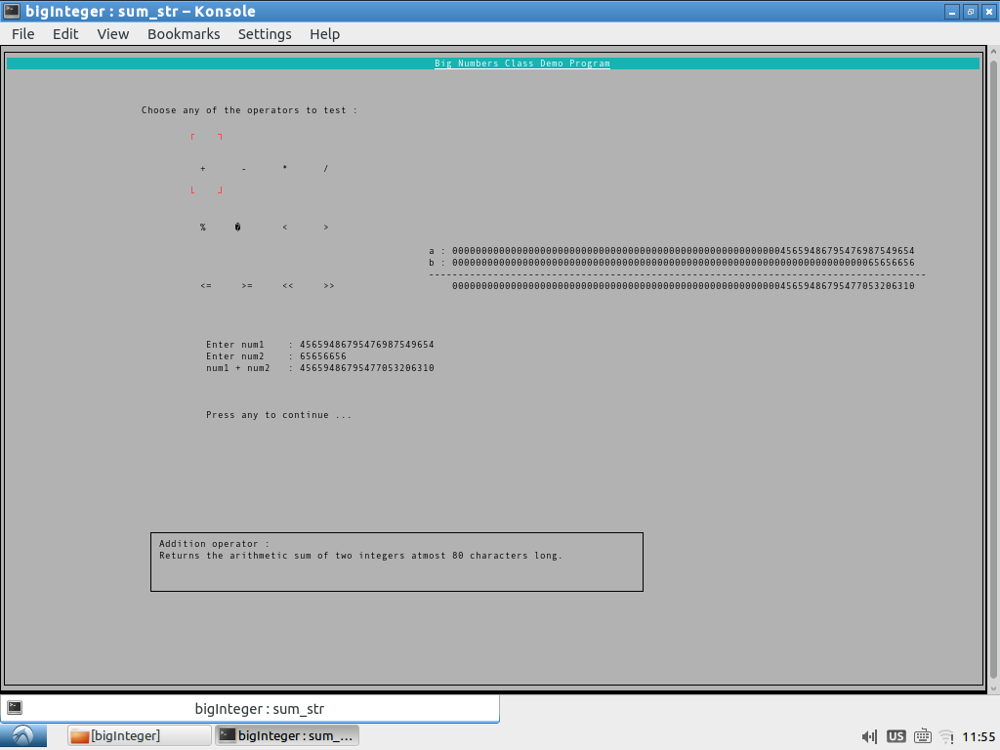
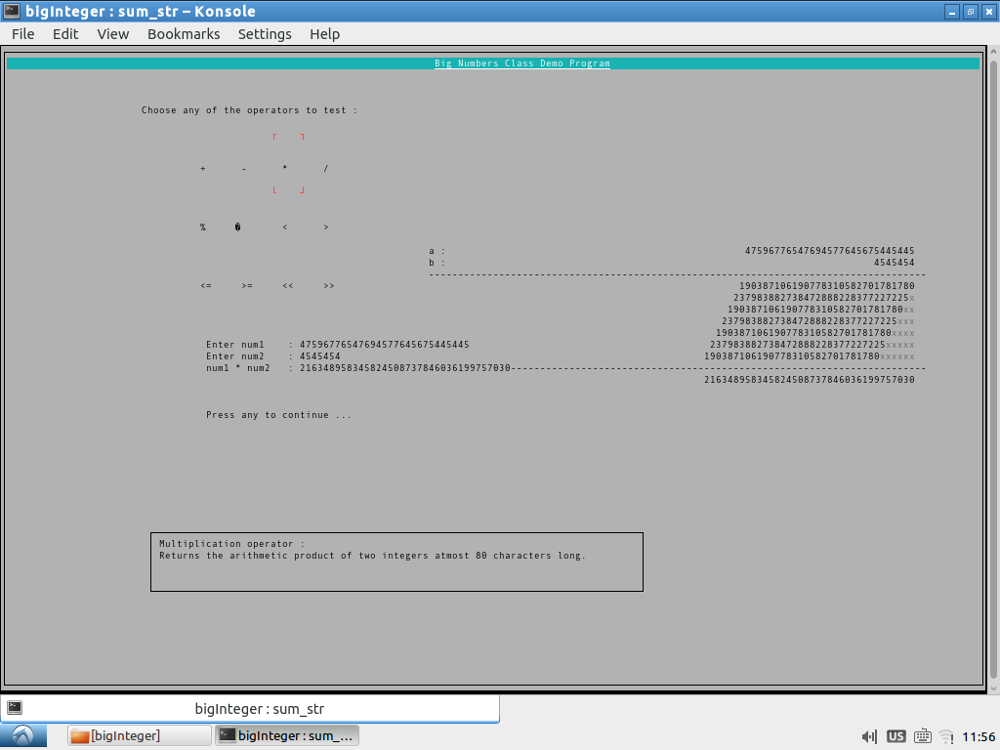
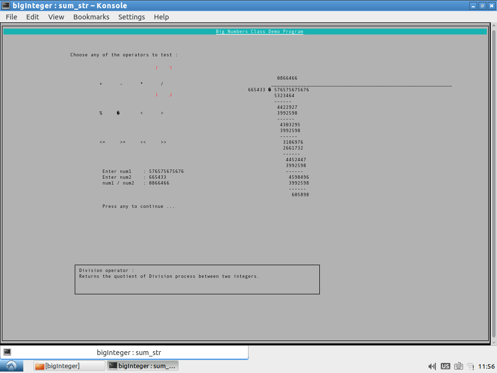
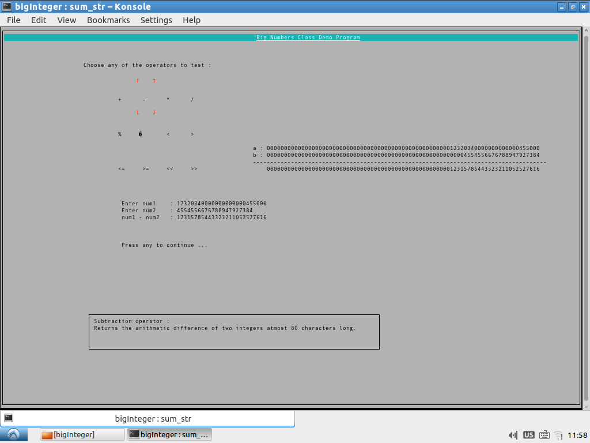

# BigInteger
A bigInteger Library designed in C++

Usually on 32, 16 bit platforms size of integer is restricted to 4 bytes/2 bytes. This
implementation of the BigInteger library provides feature similar to Java's BigInteger.
It is basically performs calculations using character arrays as the base type in order
to represent the big integers. Right now it can handle digits upto 1000 characters.

There is also a nice terminal based ui application that was initially what this project
was about. It provides nice visualization of the BigInteger operations using Ncurses with
C++.

## Screenshots:
1.) Addition:

2.) Multiplication:

3.) Division:

4.) Subtraction:

